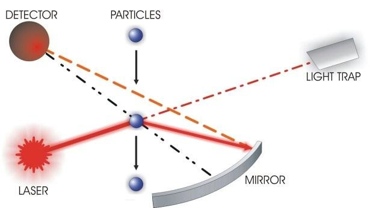
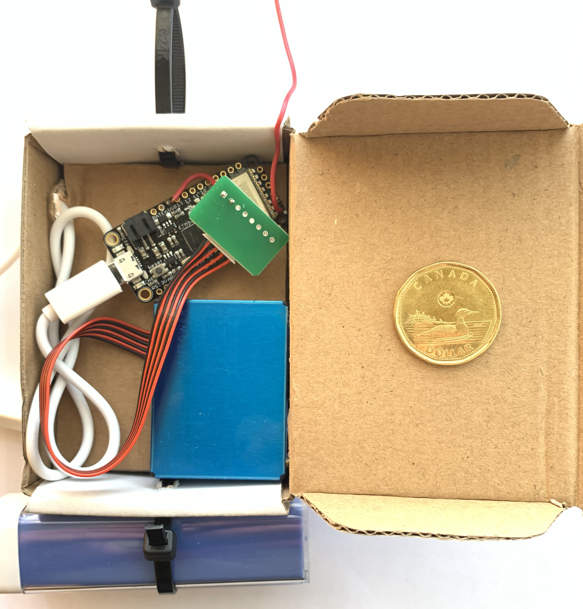
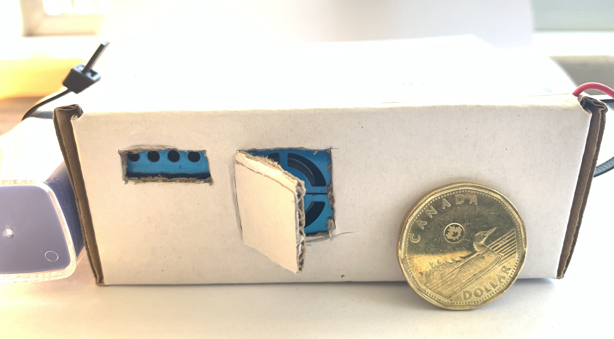
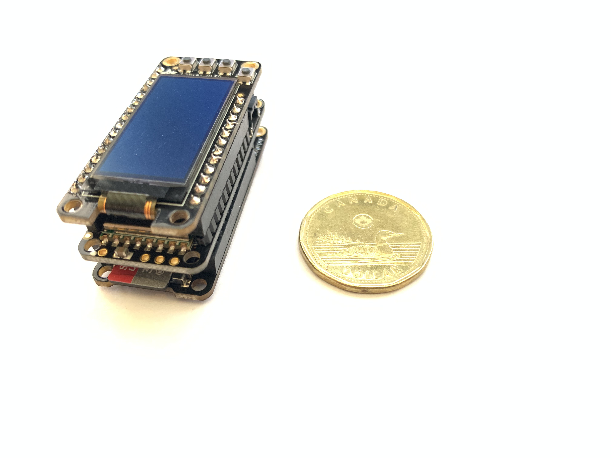
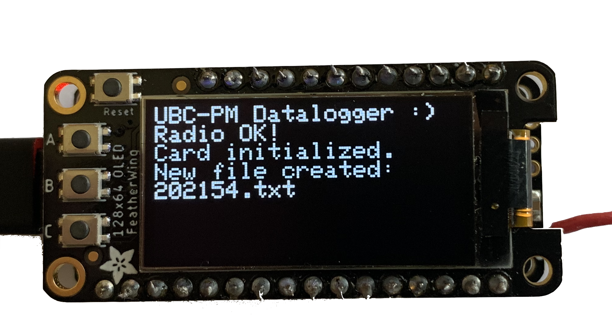

# The Sensor
## Components

The UBC AQ instrument uses the [plantower pms5003](http://www.plantower.com/en/content/?108.html) air quality sensor. The sensor is an optical particle counter (OPC) that works by measuring the orthogonal scattering of a laser beam by the particles ([Weber et al., 2010](https://doi.org/10.1117/12.869629)).

The detector observes the scattered rays and measures the signal in multiple channels, which correlate with the size distribution. The size distribution is converted to mass fractions PM10, PM2.5, PM1.0 by assuming a fixed volume of air traveling through the sensor. 

credit:[Weber et al., 2010](https://doi.org/10.1117/12.869629)

  
## Broadcast Data
The UBC Air Quality (AQ) Sensor broadcasts measured PM values using Long Range (LoRa) packet radio. The radio packet also contains sensor diagnoses such as battery voltage which, is received by a datalogger. An OLED screen (on the datalogger) displays (portions of) the incoming information—the datalogger stores all the data on a micro SD card as a text file. 

Legal operating radiofrequency for amateur use in North American is between (902 - 928 MHz).[Reference](https://www.ic.gc.ca/eic/site/smt-gst.nsf/eng/sf10759.html#t2)

### PM Sensor (Transceiver)

#### Top View

#### Side View

### Datalogger (Receiver) 

